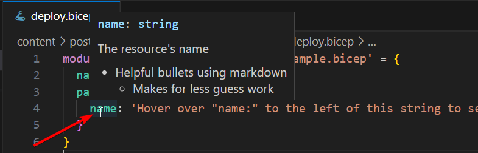

Until recently I was only authoring `Azure Bicep` files in my own projects or shared projects with a few close knit people. But once you start publishing modules to things like `Azure Container Registry (ACR)`, you might want to start considering a more verbose description. Here's a few basic examples to `flex your biceps`.

## Prerequisites

- VS Code
  - Azure Bicep Extension
- Azure Bicep
  - Understand Azure Bicep basics
  - Understand Bicep module basics

## Setup

Start by creating a folder to hold the Azure Bicep project called `src`

```powershell
New-Item "src" -ItemType Directory
```

Then add a `deploy.bicep` file as the entrypoint and a folder called `modules` for us to put the modules we will consume in our main `deploy.bicep` file

```powershell
New-Item "src/deploy.bicep" -ItemType File
New-Item "src/modules" -ItemType Directory
```

Then lastly, create a file in our modules folder for us to add the markdown syntax description for this demo

```powershell
New-Item "src/modules/example.bicep" -ItemType File
```

Your project should look like this after following the previous steps

```text
src
├── modules
│   ├── example.bicep
└── deploy.bicep
```

## Solution

Now add some example code into the `example.bicep` file with a description tag using markdown format.

{}
The second bullet is indented intentionally to demonstrate nested bullets
{}

```bicep
@description('''The resource\'s name
- Helpful bullets using markdown 
  - Makes for less guess work''')
param name string
/*
  ...deployment code
*/
```

Now update the `deploy.bicep` file to reference the module we just created in the previous step.

```bicep
module markdownExample 'modules/example.bicep' = {
  name: 'example'
  params: {
    name: 'Hover over "name:" to the left of this string to see the markdown"'
  }
}
```

If everything worked then when you hover over the `name:` property in `deploy.bicep` file then it should display something like this.



- [Full Code Example](https://github.com/JKerens/tech-blog/tree/main/content/post/2023-5%20Bicep%20Markdown/src/deploy.bicep)
